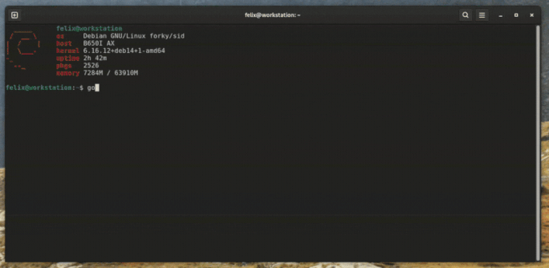

# GoTouch

[](https://github.com/felixscode/GoTouch/actions/workflows/build-and-release.yml)
[](https://go.dev/dl/)
[](https://github.com/felixscode/GoTouch/releases)
[](https://opensource.org/licenses/MIT)
[](https://goreportcard.com/report/github.com/felixscode/GoTouch)


A fast, terminal-based touch typing trainer built in Go with AI-powered adaptive learning.



## Table of Contents

- [Features](#features)
- [Installation](#installation)
- [Quick Start](#quick-start)
- [Configuration](#configuration)
  - [LLM Mode Setup](#llm-mode-setup-recommended)
  - [Choosing a Provider](#choosing-a-provider)
- [Usage](#usage)
- [Development](#development)
- [Troubleshooting](#troubleshooting)

## Features

- **🤖 AI-Powered Adaptive Learning**: Uses LLMs (Claude, GPT, or local models) to generate contextual typing exercises that adapt to your mistakes
- **🔌 Multi-Provider Support**: Choose between Anthropic Claude, OpenAI GPT, or local Ollama models
- **📊 Real-time Statistics**: Track your WPM, accuracy, and errors as you type
- **📈 Session History**: Automatic saving of typing sessions with historical statistics
- **⚡ Pure Go**: 100% written in Go, fast and lightweight

## Installation

### Pre-built Binaries (Recommended)

Download the latest pre-built binary for your platform from [GitHub Releases](https://github.com/felixscode/GoTouch/releases):

**Linux (x86_64):**
```bash
# Download the latest release
curl -LO https://github.com/felixscode/GoTouch/releases/latest/download/gotouch-linux-amd64

# Make it executable
chmod +x gotouch-linux-amd64

# Move to your PATH (optional)
sudo mv gotouch-linux-amd64 /usr/local/bin/gotouch
```

**Linux (ARM64):**
```bash
curl -LO https://github.com/felixscode/GoTouch/releases/latest/download/gotouch-linux-arm64
chmod +x gotouch-linux-arm64
sudo mv gotouch-linux-arm64 /usr/local/bin/gotouch
```

**macOS (Intel):**
```bash
curl -LO https://github.com/felixscode/GoTouch/releases/latest/download/gotouch-darwin-amd64
chmod +x gotouch-darwin-amd64
sudo mv gotouch-darwin-amd64 /usr/local/bin/gotouch
```

**macOS (Apple Silicon):**
```bash
curl -LO https://github.com/felixscode/GoTouch/releases/latest/download/gotouch-darwin-arm64
chmod +x gotouch-darwin-arm64
sudo mv gotouch-darwin-arm64 /usr/local/bin/gotouch
```

**Windows:**
```powershell
# Download gotouch-windows-amd64.exe from releases and add to your PATH
```

### Building from Source

If you prefer to build from source:

```bash
# Clone the repository
git clone https://github.com/felixscode/GoTouch.git
cd GoTouch

# Build
go build -o gotouch

# Run
./gotouch
```

**Requirements:**
- Go 1.21 or later

## Quick Start

GoTouch works out of the box with dummy text, but **LLM mode is recommended** for adaptive learning. [Set up LLM Mode](#llm-mode-setup-recommended) for the best experience.

1. **Run GoTouch:**
   ```bash
   gotouch
   ```

2. **Configure session duration** using up/down arrows (1-60 minutes)

3. **Press Enter** to start typing

4. **Type the displayed text** - correct characters appear in green, errors in red

5. **View your stats** at the end of the session

> **Tip**: Start with dummy mode to try it out, then configure an LLM provider for personalized adaptive practice!

## Configuration

GoTouch automatically manages configuration files in platform-specific directories:

**Linux/macOS:**
- Config: `~/.config/gotouch/config.yaml`
- Stats: `~/.local/share/gotouch/user_stats.json`
- API Key (optional): `~/.config/gotouch/api-key`

**Windows:**
- Config: `%APPDATA%\gotouch\config.yaml`
- Stats: `%LOCALAPPDATA%\gotouch\user_stats.json`
- API Key (optional): `%APPDATA%\gotouch\api-key`

On first run, GoTouch will automatically create a default configuration file if none exists.

### Basic Configuration

The default `config.yaml` looks like this:

```yaml
text:
  source: dummy  # Options: "dummy" or "llm"
  llm:
    provider: "anthropic"  # Options: "anthropic", "openai", "ollama"
    model: "claude-3-5-haiku-latest"  # Provider-specific model name
    api_base: ""  # Optional: Custom API endpoint (for Ollama or Azure OpenAI)
    pregenerate_threshold: 20
    fallback_to_dummy: true
    timeout_seconds: 5
    max_retries: 1
ui:
  theme: "default"  # Options: "default" or "dark"
stats:
  file_dir: "~/.local/share/gotouch/user_stats.json"  # Auto-configured
```

You can edit this file directly with your preferred text editor, or use a custom config file location with the `--config` flag.

**Example Configs Available:**
The repository includes ready-to-use configuration examples:
- `config.example.yaml` - Comprehensive example with all options
- `config.anthropic.yaml` - Pre-configured for Anthropic Claude
- `config.openai.yaml` - Pre-configured for OpenAI GPT
- `config.ollama.yaml` - Pre-configured for local Ollama

### LLM Mode Setup (Recommended)

GoTouch supports multiple LLM providers for AI-powered adaptive typing practice. Choose the provider that works best for you:

| Provider | Pros | Cons | Best For |
|----------|------|------|----------|
| **Anthropic Claude** | Fast, high quality, reasonable cost | Requires API key & internet | Most users |
| **OpenAI GPT** | Widely available, good quality | Can be expensive with GPT-4 | Existing OpenAI users |
| **Ollama (Local)** | Free, private, no internet needed | Requires local setup, slower | Privacy-focused users |

#### Option 1: Anthropic Claude (Recommended)

1. **Get an Anthropic API Key:**
   - Sign up at [https://console.anthropic.com](https://console.anthropic.com)
   - Generate an API key

2. **Configure the API key** (choose one method):

   **Method 1: Environment Variable**
   ```bash
   export GOTOUCH_LLM_API_KEY="your-anthropic-api-key"
   ```

   **Method 2: API Key File (Recommended)**
   ```bash
   # Linux/macOS
   echo "your-anthropic-api-key" > ~/.config/gotouch/api-key

   # Windows (PowerShell)
   echo "your-anthropic-api-key" > $env:APPDATA\gotouch\api-key
   ```

3. **Update config.yaml:**
   ```yaml
   text:
     source: llm
     llm:
       provider: "anthropic"
       model: "claude-3-5-haiku-latest"  # Fast and cost-effective
       # model: "claude-3-5-sonnet-latest"  # More creative, higher quality
   ```

#### Option 2: OpenAI GPT

1. **Get an OpenAI API Key:**
   - Sign up at [https://platform.openai.com](https://platform.openai.com)
   - Generate an API key

2. **Set the API key:**
   ```bash
   export GOTOUCH_LLM_API_KEY="your-openai-api-key"
   ```

3. **Update config.yaml:**
   ```yaml
   text:
     source: llm
     llm:
       provider: "openai"
       model: "gpt-4"  # or "gpt-3.5-turbo", "gpt-4-turbo"
       api_base: ""  # Optional: for Azure OpenAI or custom endpoints
   ```

#### Option 3: Ollama (Local, Free)

1. **Install Ollama:**
   - Follow instructions at [https://ollama.ai](https://ollama.ai)
   - Pull a model: `ollama pull llama2`

2. **Update config.yaml:**
   ```yaml
   text:
     source: llm
     llm:
       provider: "ollama"
       model: "llama2"  # or any model you've pulled
       api_base: "http://localhost:11434"  # Default Ollama endpoint
   ```

   No API key needed for Ollama!

4. **Run GoTouch** - it will now generate adaptive content based on your typing patterns!

### How LLM Mode Works

- **Contextual Generation**: Creates interesting, varied sentences for typing practice
- **Error Analysis**: Analyzes your typing mistakes in real-time
- **Adaptive Focus**: Pre-generates sentences targeting your problem characters and words
- **Topic Continuity**: Maintains coherent themes for natural reading/typing flow
- **Instant Display**: Shows generated text immediately as it becomes available

### Choosing a Provider

**Cost Comparison** (approximate, for 1 hour of typing practice):
- **Anthropic Claude Haiku**: ~$0.02-0.05 (highly recommended for cost/quality)
- **OpenAI GPT-3.5-turbo**: ~$0.01-0.03 (cheapest cloud option)
- **OpenAI GPT-4**: ~$0.30-0.60 (expensive but highest quality)
- **Ollama**: $0.00 (free but requires capable hardware)

**Performance**:
- **Anthropic Claude**: < 1 second response time, excellent quality
- **OpenAI GPT**: < 2 seconds response time, very good quality
- **Ollama**: 2-10 seconds depending on hardware, quality varies by model

**Privacy**:
- **Cloud providers** (Anthropic, OpenAI): Data sent to their servers
- **Ollama**: Runs locally, data never leaves your machine

## Usage

```bash
# Start with default configuration
gotouch

# Use specific config file
gotouch --config /path/to/config.yaml
```

### Keyboard Controls

**Before Session:**
- `↑/↓` - Adjust session duration (1-60 minutes)
- `Enter` - Start the typing session
- `Esc/Ctrl+C` - Exit

**During Session:**
- Type naturally - the cursor moves as you type
- `Backspace` - Correct mistakes
- `Esc/Ctrl+C` - Quit session early

**After Session:**
- `Enter` - Exit and save stats

## Quick Reference

### Common Commands

```bash
# Run with default config
gotouch

# Use custom config
gotouch --config ./my-config.yaml

# Build from source
go build -o gotouch

# Run tests
go test ./...
```

### Configuration Quick Copy

```bash
# Use Anthropic Claude (recommended)
cp config.anthropic.yaml ~/.config/gotouch/config.yaml
export GOTOUCH_LLM_API_KEY="your-anthropic-key"

# Use OpenAI GPT
cp config.openai.yaml ~/.config/gotouch/config.yaml
export GOTOUCH_LLM_API_KEY="your-openai-key"

# Use Ollama (local, free)
cp config.ollama.yaml ~/.config/gotouch/config.yaml
ollama pull llama2
```

### Model Recommendations

| Use Case | Provider | Model | Why |
|----------|----------|-------|-----|
| Best value | Anthropic | `claude-3-5-haiku-latest` | Fast, cheap, high quality |
| Highest quality | OpenAI | `gpt-4-turbo` | Best output, expensive |
| Budget cloud | OpenAI | `gpt-3.5-turbo` | Cheapest cloud option |
| Offline/Private | Ollama | `llama2` | Free, runs locally |

## Project Structure

```
GoTouch/
├── main.go                     # Entry point with CLI flag parsing
├── config.*.yaml               # Example configuration files
├── internal/
│   ├── config/                 # Configuration management
│   │   ├── paths.go            # Platform-specific path resolution
│   │   └── default.go          # Default config generation
│   ├── sources/                # Text source implementations
│   │   ├── source.go           # Text source interface
│   │   ├── llm.go              # Multi-provider LLM integration (Anthropic, OpenAI, Ollama)
│   │   ├── llm_test.go         # LLM provider tests
│   │   └── dummy.go            # Dummy text source
│   ├── types/                  # Type definitions
│   │   ├── config.go           # Configuration types
│   │   └── stats.go            # Statistics types
│   └── ui/                     # Terminal UI (Bubbletea)
│       ├── tui.go              # Main TUI application
│       └── styles.go           # Color themes
└── README.md

User Data (auto-created):
  ~/.config/gotouch/config.yaml           # Configuration (Linux/macOS)
  ~/.local/share/gotouch/user_stats.json  # Session history
  ~/.config/gotouch/api-key               # Optional API key file
```

## Development

### Running Tests

```bash
# Run all tests
go test ./...

# Run tests with coverage
go test -cover ./...

# Run LLM integration tests (requires API key)
export GOTOUCH_LLM_API_KEY="your-api-key"
go test -v ./internal/sources

# Run specific test
go test -v ./internal/sources -run TestGetText_Integration
```

### Building

```bash
# Build for current platform
go build -o gotouch

# Build for all platforms (like GitHub releases does)
GOOS=linux GOARCH=amd64 go build -o gotouch-linux-amd64
GOOS=darwin GOARCH=amd64 go build -o gotouch-darwin-amd64
GOOS=darwin GOARCH=arm64 go build -o gotouch-darwin-arm64
GOOS=windows GOARCH=amd64 go build -o gotouch-windows-amd64.exe
```

### Dependencies

- [github.com/tmc/langchaingo](https://github.com/tmc/langchaingo) - Multi-provider LLM integration (Anthropic, OpenAI, Ollama)
- [github.com/charmbracelet/bubbletea](https://github.com/charmbracelet/bubbletea) - Terminal UI framework
- [github.com/charmbracelet/lipgloss](https://github.com/charmbracelet/lipgloss) - Terminal styling
- [gopkg.in/yaml.v3](https://gopkg.in/yaml.v3) - YAML configuration

## Statistics

All typing sessions are automatically saved to `user_stats.json`. The dashboard shows:

- **Current Session**: WPM, Accuracy, Errors, Duration
- **Historical Stats**: Average WPM, Best WPM, Average Accuracy, Total Sessions

## Themes

GoTouch supports terminal themes that respect your terminal's color scheme:

- **Default Theme**: Standard terminal colors
- **Dark Theme**: Bright variants for better visibility on dark backgrounds

Configure in `config.yaml`:
```yaml
ui:
  theme: "default"  # or "dark"
```

## License

MIT License - see LICENSE file for details

## Contributing

Contributions are welcome! Please feel free to submit a Pull Request.

## Troubleshooting

### "GOTOUCH_LLM_API_KEY environment variable not set"

Make sure you've set up your API key using one of the methods in [LLM Mode Setup](#llm-mode-setup-recommended). This applies to both Anthropic and OpenAI providers (Ollama doesn't need an API key).

### LLM mode falls back to dummy text

Check your `config.yaml` - if `fallback_to_dummy: true`, the app will use dummy text when LLM fails. Set to `false` to see detailed error messages.

### Colors don't match my terminal theme

Make sure you're using one of the built-in themes. The app automatically uses your terminal's color palette.

### Session stats not saving

The app automatically creates the data directory (`~/.local/share/gotouch` on Linux/macOS). If you're seeing permission errors, check that your user has write access to this directory.

### Provider-Specific Issues

**Anthropic/OpenAI:**
- Rate limits: If you hit API rate limits, increase `timeout_seconds` or add delays between sessions
- Invalid API key: Double-check your API key is active and correctly set

**Ollama:**
- "Connection refused": Ensure Ollama is running (`ollama serve` or check system service)
- Slow responses: Local models need significant RAM/VRAM. Try smaller models like `llama2:7b`
- Model not found: Pull the model first with `ollama pull <model-name>`

### Switching Providers

To switch between providers, simply update the `provider` and `model` fields in your `config.yaml`. You can also copy one of the example configs:

```bash
# Switch to OpenAI
cp config.openai.yaml ~/.config/gotouch/config.yaml

# Switch to Ollama
cp config.ollama.yaml ~/.config/gotouch/config.yaml
```

---

**Happy Typing!** 🚀
